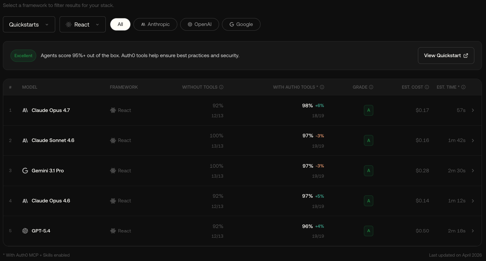

An evaluation framework for measuring how accurately LLM agents complete Auth0 integration tasks. It runs each task across multiple configurations - from a single LLM call with no tools, to a full agentic loop with MCP servers and skills - and compares the results so you can see exactly where each investment pays off.

[](https://opensource.org/licenses/Apache-2.0)

## What it's used for

We use `auth0-evals` to measure how well AI agents integrate Auth0 across our SDKs, MCP servers, and skills - and to track how those scores improve as we invest in better documentation, tooling, and agent experiences. The results power the [Auth0 Agent Experience](https://auth0.com/agent-experience) page.

[](https://auth0.com/agent-experience)

> [!NOTE]
> We develop `auth0-evals` in public for our own internal use. It is not intended for external use cases, and we provide no support, guarantees, or stability commitments for anyone building on top of it. You're welcome to read it, learn from it, provide feedback, and use it - but do so at your own risk.

## Packages

- [`@a0/eval`](packages/eval/) - CLI (`a0-eval`), agent runners (Claude Code, Copilot, Gemini CLI), scoring, and result persistence.
- [`@a0/eval-core`](packages/eval-core/) - Framework core - config loader, eval discovery, grader engine, workspace lifecycle, type definitions.
- [`@a0/eval-graders`](packages/eval-graders/) - Grader factory functions (`contains`, `notContains`, `matches`, `judge`) and the `GraderLevel` enum.
- [`@a0/eval-reporter`](packages/eval-reporter/) - Generates HTML reports from scored results.
- [`auth0-evals`](apps/auth0-evals/) - The Auth0 eval suite - task prompts, graders, scaffolds, and configuration.

## Running Evals

Running evals requires **Node.js 24+** and **Docker** (used to sandbox agent runs).

Before running the evals, ensure you install the dependencies and build the packages:

```bash
npm install
npm run build
```

Configure the `.env` file in the `apps/auth0-evals` directory with your LLM API key and GitHub token (if needed):

```bash
cp apps/auth0-evals/.env.example apps/auth0-evals/.env
# set LLM_API_KEY in apps/auth0-evals/.env
# add GH_TOKEN if running evals that use gh CLI calls (e.g. android_quickstart): gh auth token
```

Then, you can run a specific eval like this:

```bash

# Run a single eval in baseline mode
npm run evals -- --eval react_quickstart --mode baseline

# Generate an HTML report
npm run report
```

## How it works

Each eval defines a **prompt** (the task an LLM must complete) and **graders** (pass/fail checks against the generated code). The framework can run the prompt across 5 configurations:

| Configuration | What it tests |
|---|---|
| `baseline` | Single LLM call, no tools - training-data knowledge only |
| `agent` | Full agentic loop with file/shell tools |
| `agent+skills` | Agent + skill files injected into context |
| `agent+mcp` | Agent + MCP server tools |
| `agent+mcp+skills` | Agent + MCP + skills combined |

The delta between configurations tells you where to invest:

- **baseline → agent** - value of tool access alone
- **agent → agent+skills** - value of skills investment
- **agent → agent+mcp** - value of MCP server
- **agent+mcp+skills** - full compound effect

Agent runs are scored across 8 dimensions (process + output quality) into a JSON results file. See [`packages/eval`](packages/eval/) for CLI documentation and scoring details.

## Documentation

- [`packages/eval/README.md`](packages/eval/) - CLI usage, configuration, runners, scoring methodology
- [`apps/auth0-evals/README.md`](apps/auth0-evals/) - Auth0 eval suite, available evals, how to add new ones
- [`docs/ADDING_EVALS.md`](docs/ADDING_EVALS.md) - Full guide to writing evals
- [`docs/SCORING_METHODOLOGY.md`](docs/SCORING_METHODOLOGY.md) - Scoring philosophy and dimension details
- [`docs/TESTING_SKILLS.md`](docs/TESTING_SKILLS.md) - How to test skills locally

## Development

```bash
npm install       # install all workspace dependencies
npm run build     # compile all packages
npm test          # run tests across all packages
npm run lint      # lint
npm run format    # format with Prettier
```

Requires Node.js 24+ and Docker (for sandboxed agent runs).

## Feedback

### Contributing

We appreciate feedback and contribution to this repo! Before you get started, please read [Auth0's general contribution guidelines](https://github.com/auth0/open-source-template/blob/master/GENERAL-CONTRIBUTING.md).

### Raise an issue

To provide feedback or report a bug, please [raise an issue on our issue tracker](https://github.com/auth0/auth0-evals/issues).

## Vulnerability Reporting

Please do not report security vulnerabilities on the public GitHub issue tracker. The [Responsible Disclosure Program](https://auth0.com/responsible-disclosure-policy) details the procedure for disclosing security issues.

## What is Auth0?

<p align="center">
  <picture>
    <source media="(prefers-color-scheme: dark)" srcset="https://cdn.auth0.com/website/sdks/logos/auth0_dark_mode.png" width="150">
    <source media="(prefers-color-scheme: light)" srcset="https://cdn.auth0.com/website/sdks/logos/auth0_light_mode.png" width="150">
    
  </picture>
</p>
<p align="center">
  Auth0 is an easy to implement, adaptable authentication and authorization platform. To learn more check out <a href="https://auth0.com/why-auth0">Why Auth0?</a>
</p>
<p align="center">
  This project is licensed under the Apache 2.0 license. See the <a href="LICENSE">LICENSE</a> file for more info.
</p>
