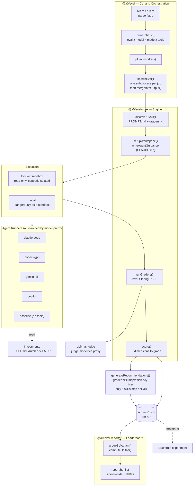
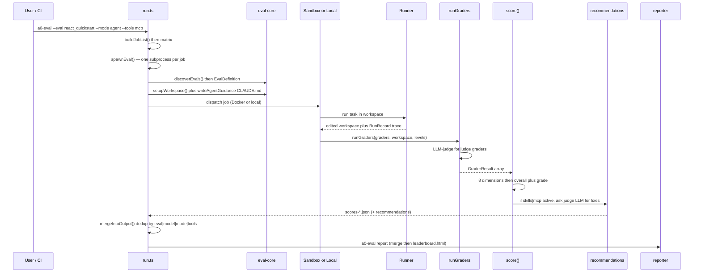

# Architecture

`auth0-evals` is a **TypeScript monorepo** (npm workspaces + Turbo) that runs LLM coding agents against Auth0 SDK integration tasks and scores the code they produce. It is the measurement engine behind Auth0's [Agent Experience](https://auth0.com/agent-experience) — the investments that make Auth0 work well for AI coding agents: **Auth0 skills** (`SKILL.md`), the **Auth0 docs MCP server**, and the **Auth0 docs** themselves. It is the measurement half of an "agent-experience flywheel": run a realistic integration task across multiple agents and investment levels, grade the generated code, and turn each score into a concrete fix for a skill, the docs MCP server, or the docs. The guiding belief — **every score must point to a fix**.

A single command expands into a **job matrix** (eval × model × mode × tools). Each job runs as an **isolated subprocess** that executes the agent in a **Docker sandbox** (or locally), grades the resulting workspace, scores it across **8 dimensions**, and — when an investment (skills/MCP) is active — asks the judge LLM for **structured recommendations** that close the loop back to the docs. Everything consolidates into an HTML **leaderboard** comparing documentation investments side-by-side.

## Layers

Bottom-up, with a clean acyclic dependency graph (`@a0/eval-graders` is the leaf, built first):

| Package | Role |
|---|---|
| `@a0/eval-graders` | Grader primitive factories (`contains`, `notContains`, `notContainsInSource`, `matches`, `judge`, `ranCommand`, `wroteFile`) + `GraderLevel` taxonomy. Zero deps. |
| `@a0/eval-core` | Engine: eval discovery, config loading, workspace setup, grader engine + executors, LLM-judge, result/scorer types. |
| `@a0/eval` | CLI, job-matrix orchestration, worker pool + per-job subprocess, Docker sandbox, the four agent runners + baseline, 8-dimension scorer, **recommendation generator** (judge-LLM → grader/skill/MCP/efficiency fixes), persistence, Braintrust reporter. |
| `@a0/eval-reporter` | Leaderboard: group/compare by eval, config, model; compute deltas vs. baseline; render Nunjucks HTML. |
| `apps/auth0-evals` | Auth0 deployment: eval suite (`src/evals/**`, 14 evals), `eval.config.js`, scaffolds, skills. |

## Architecture Diagram

## The 5 configurations

Each configuration adds **exactly one variable**, so the delta between two adjacent columns *is* the measured value of that investment.

| Configuration | CLI flags | Isolates | Grader levels |
|---|---|---|---|
| `baseline` | `--mode baseline` | Training-data knowledge | L1–L3 |
| `agent` | `--mode agent` | + agentic loop / tools | L1–L4 |
| `agent+skills` | `--mode agent --tools skills` | + SKILL.md in context | L1–L4 |
| `agent+mcp` | `--mode agent --tools mcp` | + Auth0 docs MCP | L1–L5 |
| `agent+mcp+skills` | `--mode agent --tools mcp,skills` | full investment | L1–L5 |

## End-to-end data flow

## Scoring — 8 dimensions

Overall score = weighted sum; letter grades A ≥ 90, B ≥ 75, C ≥ 60, D ≥ 40, F < 40. Process dimensions are **zeroed when the agent never executed** (0 tool calls).

| Dimension | Type | Weight | Gist |
|---|---|---|---|
| Setup Friction | Process | 12% | penalize interruptions + provider errors |
| Setup Speed | Process | 12% | active tool time vs. 60s ideal |
| Efficiency | Process | 12% | waste = dup reads + errors + overwrites + interruptions |
| Error Recovery | Process | 7% | penalize provider errors |
| Docs Quality | Process | 7% | valid doc URLs, no error, no rewrite-after-fetch |
| Correctness | Output | 25% | L1/L4/L5 grader pass rate (excludes L2/L3) |
| Hallucination | Output | 15% | L2 grader pass rate |
| Security | Output | 10% | L3 grader pass rate |

## Closing the loop — recommendations

Scores diagnose; **recommendations prescribe** — this is the "every score must point to a fix" principle in code. After scoring, when the run had **skills or MCP enabled** (`generateRunRecommendations` returns early otherwise), the judge LLM receives the full context — PROMPT.md, the agent's workspace output, the skill content actually injected, the grader pass/fail table, the 8 dimensions, and the tool-call efficiency breakdown — and returns structured JSON:

| Category | Targets | Example |
|---|---|---|
| `grader` | Missing checks, false pos/neg, over-strict criteria | "L4 grader misses the `audience` config key" |
| `skill` | Skill doc mistakes, gaps, confusing/outdated instructions | "SKILL.md omits the `cacheLocation` option" |
| `mcp` | Missing custom MCP tools, unhelpful responses, tool UX | "Add a `get_quickstart` tool returning the canonical snippet" |
| `efficiency` | Thrashing patterns better docs/tools would prevent | "Agent retried the redirect-URI config 3× — document it" |

Each recommendation carries a `severity` (high/medium/low, sorted high-first) and is scoped to the **custom** skills/MCP tools — never the agent's built-in base tools. The generator never throws (returns `undefined` on any failure), strips `.env*` files from the prompt, and treats workspace files as untrusted data. Results are persisted alongside scores and surfaced in the leaderboard.

## Grader levels

| Level | Enum | Tests | Runs in |
|---|---|---|---|
| L1 | `positive_presence` | required SDK symbols/imports present | all configs |
| L2 | `hallucination` | hallucinated packages absent | all configs |
| L3 | `security` | no hardcoded secrets | all configs |
| L4 | `structural` | code correctly wired | agent configs |
| L5 | `version_correctness` | current API, not deprecated | agent+mcp configs |

Every eval ends with one holistic `judge()` with **no level** — it always runs.

## Components

- **`@a0/eval-graders`** — `primitives.ts`, `types.ts`. Leaf; no deps.
- **`@a0/eval-core`** — `discovery.ts`, `loader.ts`, `config/*`, `workspace/workspace.ts`, `graders/engine.ts` + `executors/*`, `graders/llm-judge.ts`, `types/*`. Depends on `@a0/eval-graders`.
- **`@a0/eval`** — `cli/{bin,run,config,constants,report,subprocess-runner,sandbox-runner}.ts`, `scorer.ts`, `waste.ts`, `sandbox/docker.ts`, `runners/{claude-code,codex,gemini-cli,copilot,baseline}/*`, `recommendations/{generator,run-helper,collect-skill-content}.ts`, `persistence/*`, `reporters/braintrust*.ts`. Depends on `@a0/eval-core` + `@a0/eval-reporter` + agent SDKs. `sandbox-runner.ts` is the in-container entry point (invoked by `docker/entrypoint.sh`); it scores and generates recommendations inside the sandbox so the host only reads back JSON.
- **`@a0/eval-reporter`** — `report.ts`, `report/processors.ts`, `templates/report.html.j2`. Depends on `@a0/eval-core` + `@a0/eval-graders` + `marked` + `nunjucks`.
- **`apps/auth0-evals`** — eval suite, `eval.config.js`, scaffolds, skills.

## Runners (auto-routed by model prefix)

| Runner | Models | SDK |
|---|---|---|
| `claude-code` | `claude-*` | `@anthropic-ai/claude-agent-sdk` (`query()`) |
| `codex` | `gpt-*` | `@openai/codex-sdk` (`thread.runStreamed()`) |
| `gemini-cli` | `gemini-*` | `@google/gemini-cli` |
| `copilot` | else (default) | `@github/copilot-sdk` |
| `baseline` | any (no tools) | `ai` + `@ai-sdk/openai` single-shot |

New runners plug in via `registerRunner(id, impl)` with no dispatcher changes (Registry + Strategy).

## Integration points

- **LLM proxy** (`proxy.baseUrl`) — fronts all providers; Bedrock (`/anthropic`) or LiteLLM endpoints. Per-agent overrides (`agents.<id>.proxy.baseUrl`) fall back to the shared base URL. The recommendation generator hits the plain `/chat/completions` endpoint (alias sent as-is, no Bedrock map).
- **Auth0 docs MCP** (`https://auth0.com/docs/mcp`) — injected when `--tools mcp`.
- **Skills sources** — local `skills/` dirs **plus** a remote repo (`auth0/agent-skills`, branch via `REMOTE_SKILLS_BRANCH`) cloned to `skills-remote/`; injected when `--tools skills`.
- **Braintrust** — optional experiment logging (`--braintrust`).
- **No database** — results are JSON files (`scores-*.json`); **no cloud IaC** in repo.

## Sandbox

`docker/Dockerfile` builds `auth0-evals:latest` (node:24-bookworm builder → slim runtime). Each job runs in a container with `--cap-drop=ALL`, `--read-only`, tmpfs `/tmp` (2g) + `/home/node` (1g), `--memory=6g --cpus=2 --pids-limit=512`, IPv6 disabled, `host.docker.internal` → loopback, 35-min hard timeout. `--dangerously-skip-sandbox` runs on the host instead.

## Conventions

- **ESM** — every import uses a `.js` extension (even for `.ts` sources); `node:` prefix for builtins; `import type` for type-only.
- **Tools return tuples, never throw** — `[message, isDoc, isInterrupt, isError]`; paths resolved via `resolveInside()` (throws on traversal).
- **Build** — Turbo (`^build` topological ordering, `dist/**` outputs); Vitest tests per package; ESLint flat config + Prettier; husky + lint-staged pre-commit.
