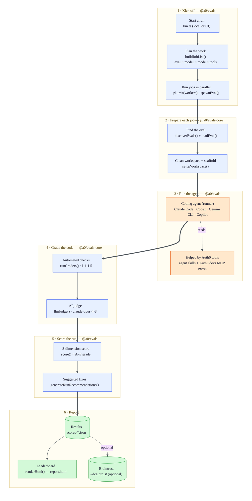
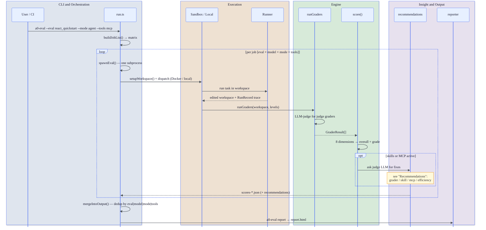

# Architecture

`auth0-evals` is a **TypeScript monorepo** (npm workspaces + Turbo) that runs LLM coding agents against Auth0 SDK integration tasks and scores the code they produce.

It does two things:

1. **Measures the Agent Experience (AX) of integrating Auth0** — how well AI coding agents complete real Auth0 integration tasks.
2. **Produces actionable insights to improve it** — concrete fixes for the three investments behind Auth0's [Agent Experience](https://auth0.com/agent-experience): **Auth0 skills** ([auth0/agent-skills](https://github.com/auth0/agent-skills)), the **Auth0 docs MCP server**, and the **Auth0 docs**.

The loop: run a realistic integration task across multiple agents and investment levels, grade the generated code, and turn each score into a fix. The guiding belief — **every score must point to a fix**.

## Architecture Diagram

An `a0-eval run` expands into a job matrix (eval × model × mode × tools); each job walks the same six stages — **Kick off → Prepare → Run the agent → Grade → Score → Report** — fanning out under a `pLimit(workers)` gate (one subprocess and Docker sandbox per job) and converging at `mergeResults()`. Every box names the function behind it, so the diagram doubles as a call map. Colours mark the layer: control plane (`@a0/evals` + `@a0/evals-core`), execution plane (the runner + Auth0 tools it reads), data plane (the artifacts it leaves behind).

## Component responsibilities

Bottom-up, with a clean acyclic dependency graph (`@a0/evals-graders` is the leaf, built first):

### `@a0/evals-graders`
- **Purpose**: Grader primitive factories + level taxonomy.
- **Responsibilities**: Produce `GraderDef` descriptors (`contains`, `notContains`, `notContainsInSource`, `matches`, `judge`, `ranCommand`, `ranCommandOneOf`, `wroteFile`); define `GraderLevel` (L1–L5) and validate that event graders use L4/L5 only.
- **Dependencies**: None (leaf).
- **Type**: Shared library / SDK.

### `@a0/evals-core`
- **Purpose**: Evaluation engine.
- **Responsibilities**: Eval discovery (`discoverEvals`) and loading (`loadEval`); framework config load/merge (`loadConfig`, `defineConfig`); workspace lifecycle (`setupWorkspace`, `cleanupWorkspace`, `writeAgentGuidance`); grader engine with a pluggable executor **registry** (`registerExecutor`/`getExecutor`/`executeGrader`); LLM judge; the `AgentRunner` and `ToolTranslator` interfaces; trace classification; result serializers.
- **Dependencies**: `@a0/evals-graders`.
- **Type**: Application infrastructure / engine.

### `@a0/evals`
- **Purpose**: CLI, orchestration, runners, scoring, insight, persistence, reporting glue.
- **Responsibilities**: Flag parsing (`commander`); job-matrix build with model-prefix auto-routing; worker-pool parallelism (`p-limit`) + per-job subprocess spawning; Docker sandbox lifecycle; four concrete agent runners + baseline; 8-dimension scorer + waste analysis; recommendation generator; result persistence/merge; Braintrust reporter.
- **Sandbox entry point**: `cli/sandbox-runner.ts` (invoked by `docker/entrypoint.sh`) scores and generates recommendations **inside** the sandbox, so the host only reads back the resulting JSON.
- **Dependencies**: `@a0/evals-core`, `@a0/evals-reporter`, agent SDKs (`@anthropic-ai/claude-agent-sdk`, `@openai/codex-sdk`, `@github/copilot-sdk`, `@google/gemini-cli`), `ai` + `@ai-sdk/openai`, `braintrust`, `commander`, `p-limit`, `dotenv`.
- **Type**: Application (publishes the `a0-eval` binary).

### `@a0/evals-reporter`
- **Purpose**: HTML leaderboard rendering.
- **Responsibilities**: `groupResults`/`groupByVariant`/`computeDeltas`; Nunjucks template (`report.html.j2`) with CSS-class and markdown filters; aggregate cost/run stats; ordered variant display.
- **Dependencies**: `@a0/evals-core`, `@a0/evals-graders`, `marked`, `nunjucks`.
- **Type**: Application infrastructure / reporting.

### `apps/auth0-evals`
- **Purpose**: Auth0's concrete deployment.
- **Responsibilities**: The 14-eval suite (`src/evals/**`), `eval.config.js` (proxy, models, MCP server, skills sources, judge, scoring allowlist), the React scaffolds, and the local skills dir. Publishes thin `evals`/`report` npm scripts that shell out to `a0-eval`.
- **Dependencies**: `@a0/evals`, `@a0/evals-graders`, `@a0/evals-reporter`, `commander`.
- **Type**: Application / deployment.

## Runners (auto-routed by model prefix)

| Runner | Models | SDK |
|---|---|---|
| `claude-code` | `claude-*` | `@anthropic-ai/claude-agent-sdk` (`query()`) |
| `codex` | `gpt-*` | `@openai/codex-sdk` (`thread.runStreamed()`) |
| `gemini-cli` | `gemini-*` | `@google/gemini-cli` |
| `copilot` | else (default) | `@github/copilot-sdk` |
| `baseline` | any (no tools) | `ai` + `@ai-sdk/openai` single-shot |

New runners plug in via `registerRunner(id, impl)` with no dispatcher changes (Registry + Strategy).

Each runner ships a `ToolTranslator` that normalizes its SDK's tool names to one **canonical vocabulary** — `run_command`, `read_file`, `write_file`, `list_files`, `fetch_url`, `ask_user` — so trace classification, waste analysis, and scoring see the same signals regardless of vendor (`base-translator.ts`, `runners/classify.ts`).

## Grader levels

| Level | Enum | Tests | Runs in |
|---|---|---|---|
| L1 | `positive_presence` | required SDK symbols/imports present | all configs |
| L2 | `hallucination` | hallucinated packages absent | all configs |
| L3 | `security` | no hardcoded secrets | all configs |
| L4 | `structural` | code correctly wired | agent configs |
| L5 | `version_correctness` | current API, not deprecated | agent+mcp configs |

Every eval ends with one holistic `judge()` with **no level** — it always runs.

> Full authoring detail (per-level intent, code examples): [`docs/ADDING_EVALS.md`](ADDING_EVALS.md).

## The 5 configurations

Each configuration adds **exactly one variable**, so the delta between two adjacent columns *is* the measured value of that investment.

| Configuration | CLI flags | Isolates | Grader levels |
|---|---|---|---|
| `baseline` | `--mode baseline` | Training-data knowledge | L1–L3 |
| `agent` | `--mode agent` | + agentic loop / tools | L1–L4 |
| `agent+skills` | `--mode agent --tools skills` | + SKILL.md in context | L1–L4 |
| `agent+mcp` | `--mode agent --tools mcp` | + Auth0 docs MCP | L1–L5 |
| `agent+mcp+skills` | `--mode agent --tools mcp,skills` | full investment | L1–L5 |

## End-to-end data flow

## Scoring — 8 dimensions

The overall score is a **weighted sum** of 8 dimensions, split evenly between *how* the agent worked (Process, 50%) and *what* it produced (Output, 50%). Process dimensions are **zeroed when the agent never executed** (0 tool calls), so a no-op run can't score well on efficiency.

**Process — how the agent worked (50%)**

| Dimension | Weight | Gist |
|---|---|---|
| Setup Friction | 12% | penalize interruptions + provider errors |
| Setup Speed | 12% | active tool time vs. 60s ideal |
| Efficiency | 12% | waste = dup reads + errors + overwrites + interruptions |
| Error Recovery | 7% | penalize provider errors |
| Docs Quality | 7% | valid doc URLs, no error, no rewrite-after-fetch |

**Output — what the agent produced (50%)**

| Dimension | Weight | Gist |
|---|---|---|
| Correctness | 25% | L1/L4/L5 grader pass rate (excludes L2/L3) |
| Hallucination | 15% | L2 grader pass rate |
| Security | 10% | L3 grader pass rate |

**Letter grades:** A ≥ 90 · B ≥ 75 · C ≥ 60 · D ≥ 40 · F < 40

> This is a summary. Decision rationale: [`docs/SCORING_METHODOLOGY.md`](SCORING_METHODOLOGY.md).

## Recommendations — turning scores into fixes

Scores diagnose; **recommendations prescribe** — the "every score must point to a fix" principle, in code.

When a run had **skills or MCP enabled**, `generateRunRecommendations` hands the judge LLM the full run context (task, workspace output, injected skill content, grader results, scoring dimensions, efficiency breakdown) and gets back structured JSON: a `severity`-ranked list of fixes, each targeting one of four things to improve.

| Category | What it flags | Example |
|---|---|---|
| `grader` | Missing checks, false pos/neg, over-strict criteria | "L4 grader misses the `audience` config key" |
| `skill` | Skill doc gaps, confusing or outdated instructions | "SKILL.md omits the `cacheLocation` option" |
| `mcp` | Missing MCP tools, unhelpful responses, poor tool UX | "Add a `get_quickstart` tool returning the canonical snippet" |
| `efficiency` | Thrashing that better docs/tools would prevent | "Agent retried the redirect-URI config 3× — document it" |

Recommendations are scoped to **custom** skills/MCP tools (never the agent's built-in tools), then persisted alongside scores and surfaced in the leaderboard. The step is safe by construction: it never throws (returns `undefined` on failure) and strips `.env*` from the prompt.

## Sandbox — running untrusted agent code safely

By default each job runs inside a hardened, ephemeral **Docker sandbox**. The container starts as root only long enough for the entrypoint (`docker/entrypoint.sh`) to apply network rules, then drops to an unprivileged user before any agent code runs. `cli/sandbox-runner.ts` scores and generates recommendations **inside** the box and writes `.eval-results.json`, so the host only reads the JSON back — agent output never executes on the host.

| Control | How it's enforced |
|---|---|
| **Network fail-closed** | `iptables` default-DROP on INPUT/OUTPUT/FORWARD; only established/related, loopback, and explicit DNS are allowed (`entrypoint.sh`). |
| **Read-only code** | `chmod -R a-w /app/node_modules /app/packages /app/apps` in the image — the agent can't mutate framework code (`docker/Dockerfile`). |
| **Validated mount** | The workspace mount is checked to live under the OS temp dir (`realpathSync(tmpdir())`) to prevent mounting arbitrary host paths (`sandbox/docker.ts`). |
| **Dropped privileges** | Runs as UID 1000 (`node`) with `--cap-drop=ALL` and `setpriv --inh-caps=-all`, so the process holds zero capabilities. |

`--dangerously-skip-sandbox` runs directly on the host instead (debugging only).

## Framework vs. consumer

The **framework** ([auth0/auth0-evals](https://github.com/auth0/auth0-evals)) — the engine, graders, runners, and eval suite — is environment-agnostic. A **consumer** supplies only two things to run it: a settings file (`eval.config.js` — which models, docs MCP server, and skills to use) and an access key (`LLM_API_KEY`, read from the env). Everything environment-specific lives in the consumer, so the framework stays clean and behaves identically wherever it runs.

| Consumer | What it is |
|---|---|
| **Laptop** | Clone + `npm install`, point `eval.config.js` at the models you want, put `LLM_API_KEY` in `.env`, run `npm run evals -- --eval <id> …`, then `npm run report`. For developing and spot-checking. |
| **CI pipeline** | A thin wrapper that **pins a framework version** (reproducible runs), **builds once** and shares `dist/` across workers, **fans out the full matrix** as sandboxed jobs, and **merges** every `scores-*.json` into one leaderboard. |

