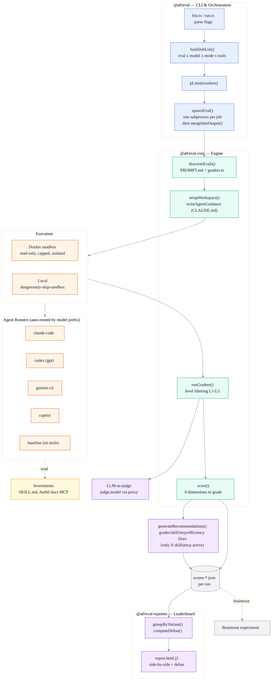

# Architecture

`auth0-evals` is a **TypeScript monorepo** (npm workspaces + Turbo) that runs LLM coding agents against Auth0 SDK integration tasks and scores the code they produce.

It does two things:

1. **Measures the Agent Experience (AX) of integrating Auth0** — how well AI coding agents complete real Auth0 integration tasks.
2. **Produces actionable insights to improve it** — concrete fixes for the three investments behind Auth0's [Agent Experience](https://auth0.com/agent-experience): **Auth0 skills** ([auth0/agent-skills](https://github.com/auth0/agent-skills)), the **Auth0 docs MCP server**, and the **Auth0 docs**.

The loop: run a realistic integration task across multiple agents and investment levels, grade the generated code, and turn each score into a fix. The guiding belief — **every score must point to a fix**.

## Layers

Bottom-up, with a clean acyclic dependency graph (`@a0/eval-graders` is the leaf, built first):

| Package | Role |
|---|---|
| `@a0/eval-graders` | Grader primitive factories (`contains`, `notContains`, `notContainsInSource`, `matches`, `judge`, `ranCommand`, `wroteFile`) + `GraderLevel` taxonomy. Zero deps. |
| `@a0/eval-core` | Engine: eval discovery, config loading, workspace setup, grader engine + executors, LLM-judge, result/scorer types. |
| `@a0/eval` | CLI, job-matrix orchestration, worker pool + per-job subprocess, Docker sandbox, the four agent runners + baseline, 8-dimension scorer, **recommendation generator** (judge-LLM → grader/skill/MCP/efficiency fixes), persistence, Braintrust reporter. |
| `@a0/eval-reporter` | Leaderboard: group/compare by eval, config, model; compute deltas vs. baseline; render Nunjucks HTML. |
| `apps/auth0-evals` | Auth0 deployment: eval suite (`src/evals/**`, 14 evals), `eval.config.js`, scaffolds, skills. |

## Architecture Diagram



## The 5 configurations

Each configuration adds **exactly one variable**, so the delta between two adjacent columns *is* the measured value of that investment.

| Configuration | CLI flags | Isolates | Grader levels |
|---|---|---|---|
| `baseline` | `--mode baseline` | Training-data knowledge | L1–L3 |
| `agent` | `--mode agent` | + agentic loop / tools | L1–L4 |
| `agent+skills` | `--mode agent --tools skills` | + SKILL.md in context | L1–L4 |
| `agent+mcp` | `--mode agent --tools mcp` | + Auth0 docs MCP | L1–L5 |
| `agent+mcp+skills` | `--mode agent --tools mcp,skills` | full investment | L1–L5 |

## End-to-end data flow

```mermaid
%%{init: {'theme':'base', 'mirrorActors': false, 'themeVariables': {
  'primaryColor':'#E7F0FF','primaryBorderColor':'#4C6EF5','primaryTextColor':'#1A1A2E',
  'actorBkg':'#E7F0FF','actorBorder':'#4C6EF5','actorTextColor':'#1A1A2E',
  'signalColor':'#495057','signalTextColor':'#1A1A2E','noteBkgColor':'#FFF9DB','noteBorderColor':'#F08C00',
  'fontFamily':'ui-sans-serif, system-ui, sans-serif'
}}}%%
sequenceDiagram
    box rgba(231,240,255,0.5) Host — @a0/eval CLI
        participant U as User / CI
        participant CLI as run.ts
    end
    box rgba(230,252,245,0.5) Engine — @a0/eval-core
        participant Core as eval-core
        participant Grade as runGraders
        participant Score as score()
    end
    box rgba(255,244,230,0.5) Execution
        participant Exec as Sandbox / Local
        participant Agent as Runner
    end
    box rgba(243,232,255,0.5) Insight &amp; Output
        participant Recs as recommendations
        participant Rep as reporter
    end

    U->>CLI: a0-eval --eval react_quickstart --mode agent --tools mcp
    CLI->>CLI: buildJobList() → matrix
    CLI->>CLI: spawnEval() — one subprocess per job
    CLI->>Core: discoverEvals() → EvalDefinition
    CLI->>Core: setupWorkspace() + writeAgentGuidance (CLAUDE.md)
    CLI->>Exec: dispatch job (Docker or local)
    Exec->>Agent: run task in workspace
    Agent-->>Exec: edited workspace + RunRecord trace
    Exec->>Grade: runGraders(graders, workspace, levels)
    Grade->>Grade: LLM-judge for judge graders
    Grade-->>Score: GraderResult array
    Score->>Score: 8 dimensions → overall + grade
    opt skills or MCP active
        Score->>Recs: ask judge LLM for fixes
        Note over Recs: see "Closing the loop" →<br/>grader / skill / mcp / efficiency
    end
    Recs-->>CLI: scores-*.json (+ recommendations)
    CLI->>CLI: mergeIntoOutput() — dedup by eval|model|mode|tools
    CLI->>Rep: a0-eval report → leaderboard.html
```

## Scoring — 8 dimensions

The overall score is a **weighted sum** of 8 dimensions, split evenly between *how* the agent worked (Process, 50%) and *what* it produced (Output, 50%). Process dimensions are **zeroed when the agent never executed** (0 tool calls), so a no-op run can't score well on efficiency.

**Process — how the agent worked (50%)**

| Dimension | Weight | Gist |
|---|---|---|
| Setup Friction | 12% | penalize interruptions + provider errors |
| Setup Speed | 12% | active tool time vs. 60s ideal |
| Efficiency | 12% | waste = dup reads + errors + overwrites + interruptions |
| Error Recovery | 7% | penalize provider errors |
| Docs Quality | 7% | valid doc URLs, no error, no rewrite-after-fetch |

**Output — what the agent produced (50%)**

| Dimension | Weight | Gist |
|---|---|---|
| Correctness | 25% | L1/L4/L5 grader pass rate (excludes L2/L3) |
| Hallucination | 15% | L2 grader pass rate |
| Security | 10% | L3 grader pass rate |

**Letter grades:** A ≥ 90 · B ≥ 75 · C ≥ 60 · D ≥ 40 · F < 40

## Closing the loop — recommendations

Scores diagnose; **recommendations prescribe** — the "every score must point to a fix" principle, in code.

This step runs only when the run had **skills or MCP enabled** (otherwise `generateRunRecommendations` returns early). The judge LLM is given the full run context:

- the task (`PROMPT.md`)
- the agent's workspace output
- the skill content that was actually injected
- the grader pass/fail table
- the 8 scoring dimensions
- the tool-call efficiency breakdown

It returns structured JSON — a list of recommendations, each in one of four categories:

| Category | Targets | Example |
|---|---|---|
| `grader` | Missing checks, false pos/neg, over-strict criteria | "L4 grader misses the `audience` config key" |
| `skill` | Skill doc mistakes, gaps, confusing/outdated instructions | "SKILL.md omits the `cacheLocation` option" |
| `mcp` | Missing custom MCP tools, unhelpful responses, tool UX | "Add a `get_quickstart` tool returning the canonical snippet" |
| `efficiency` | Thrashing patterns better docs/tools would prevent | "Agent retried the redirect-URI config 3× — document it" |

**Guarantees:**

- Each recommendation has a `severity` (high/medium/low), sorted high-first.
- Scoped to the **custom** skills/MCP tools — never the agent's built-in base tools.
- Safe by construction: never throws (returns `undefined` on failure), strips `.env*` from the prompt, treats workspace files as untrusted data.
- Persisted alongside scores and surfaced in the leaderboard.

## Grader levels

| Level | Enum | Tests | Runs in |
|---|---|---|---|
| L1 | `positive_presence` | required SDK symbols/imports present | all configs |
| L2 | `hallucination` | hallucinated packages absent | all configs |
| L3 | `security` | no hardcoded secrets | all configs |
| L4 | `structural` | code correctly wired | agent configs |
| L5 | `version_correctness` | current API, not deprecated | agent+mcp configs |

Every eval ends with one holistic `judge()` with **no level** — it always runs.

## Components

| Package | Key files | Depends on |
|---|---|---|
| `@a0/eval-graders` | `primitives.ts`, `types.ts` | — (leaf) |
| `@a0/eval-core` | `discovery.ts`, `loader.ts`, `config/*`, `workspace/*`, `graders/engine.ts` + `executors/*`, `graders/llm-judge.ts`, `types/*` | `@a0/eval-graders` |
| `@a0/eval` | `cli/*`, `scorer.ts`, `waste.ts`, `sandbox/docker.ts`, `runners/*`, `recommendations/*`, `persistence/*`, `reporters/*` | `@a0/eval-core`, `@a0/eval-reporter`, agent SDKs |
| `@a0/eval-reporter` | `report.ts`, `report/processors.ts`, `templates/report.html.j2` | `@a0/eval-core`, `@a0/eval-graders`, `marked`, `nunjucks` |
| `apps/auth0-evals` | eval suite, `eval.config.js`, scaffolds, skills | `@a0/eval` |

> **Note:** in `@a0/eval`, `cli/sandbox-runner.ts` is the in-container entry point (invoked by `docker/entrypoint.sh`). It scores and generates recommendations **inside** the sandbox, so the host only reads back the resulting JSON.

## Runners (auto-routed by model prefix)

| Runner | Models | SDK |
|---|---|---|
| `claude-code` | `claude-*` | `@anthropic-ai/claude-agent-sdk` (`query()`) |
| `codex` | `gpt-*` | `@openai/codex-sdk` (`thread.runStreamed()`) |
| `gemini-cli` | `gemini-*` | `@google/gemini-cli` |
| `copilot` | else (default) | `@github/copilot-sdk` |
| `baseline` | any (no tools) | `ai` + `@ai-sdk/openai` single-shot |

New runners plug in via `registerRunner(id, impl)` with no dispatcher changes (Registry + Strategy).
